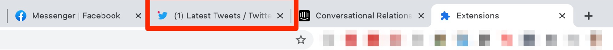
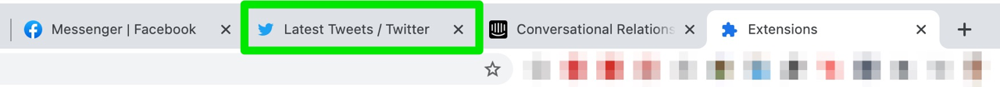

# Stop Tab Title Flashing

These are annoying.

...

Turn them into these.

## Usage

Install from the Chrome app store, or load the unpacked extension yourself.

Quickly hacked together from [this post](https://webapps.stackexchange.com/questions/74830/how-to-disable-the-flashing-title-when-someone-messages-me-on-facebook).
